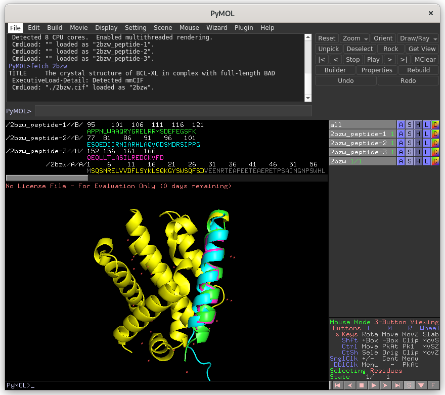

# PEPIT

\(C\) Frédéric Guyon, Gautier Moroy

**Non-sequential alignment of binding sites for fast peptide screening**


## Abstract

The PepIT program proposes peptides that may interact with a given protein. PepIT is based on a non-sequential alignment algorithm to identify peptide binding sites that share geometrical and physicochemical properties with regions on the target protein. PepIT compares the entire surface of the target protein with the peptide binding sites in the Propedia dataset, which contains more than 19,000 high-resolution protein-peptide structures. Once a peptide binding site similar to a portion of the protein surface is found, the peptide inserted into the binding site is repositioned on the corresponding portion of the protein surface. 

## Dependencies

The R program is required as Pepit is a R package.
A few R scripts are included that make use of the pepit R package.
No R programming is required.

## Installation

The pepit package is installed on github repository https://github.com/DSIMB/pepit.

Invoke R and type:

```R
install.packages("devtools")
```

```R
library(devtools)
```

```R
install_github("DSIMB/pepit")
```

## Usage

Two scripts make use of the package pepit.

BuiltBSBank.R   builds a bank of protein-peptide complexes with the format expected by pepit

pepit.R performs a search of a binding site of the bank similar to the given protein target.


### Bank of complexes preparation

As input, the script takes a bank description file, that is a 3 columns file with a header, that can be read by
R as a data frame. 

The second input is a directory name where are written the ouput complexe pdb files.

Example:
```bash
mkdir Bank
```

For example, with the following file nanobank.dat
```bash
PDB Receptor.Chain Peptide.Chain
148l E S
1a07 A C
1a07 B D
1a08 A C
```

```bash
Rscript ./BuiltBSBank.R nanobank.dat Bank
```

the script produces 4 pdb files  `148lE:S.pdb`  `1a07A:C.pdb`  `1a07B:D.pdb`  `1a08A:C.pdb`

### Peptide search
use the script `pepit.R`

```bash
Rscript ./pepit.R target target_chain BSBank prefix
```

- target is a pdb file or a pdb id. In this case, `pepit.R` download the pdb file from the Protein Data Bank RCSB PDB.
- target_chain gives the receptor chain of the pdb target file. It can be a single character or a list of chains as H,L or A,B,C or "*" meaning all the protein chains (the double quote are mandatory)
- BSBank is binding site bank created by `BuiltBSBank.R`
- prefix is a string used as a prefix for the names of all the output files.

By default, `pepit.R` produces 1 output file : <prefix>.score

It is possible to change the default values of the program parameters at the beginning of the script file.

All the parameter default values are indicated in `pepit/inst/default_parameters.R`. This R file cannot be used to change the values

of the parameters, it is just here for information. The parameters must be changed in the R scripts `pepit.R

For example, if the parameter POSE is set to TRUE, an alignment file that gives the mapping between the protein target and the selected binding sites is output.

This file name is  <prefix>.al. PDB files with the selected peptides posed onto the target are also produced.

### Example

We search for a peptide able to interact with a BCL-XL target with pdb id 2bzw.

The pdb file contains a structure of BCL-XL (chain A) in complex with the peptide BAD (chain B).

For the test, we consider the chain A only and we compare it to 4 binding sites of 2bzw, 3r85, 4qve, 1cm1.

2bzw, 3r85, 4qve are BCL-XL structures complexed to different peptides and 1cm1 is  calmodulin that is not homologous to BCL-XL.

The input text file `nanobank.dat` used to construct the binding site bank is:
```bash
PDB Receptor.Chain Peptide.Chain 
2bzw A B
3r85 D H
4qve A B
1cm1 A B
```
The R script `BuiltBSBank.R` in `pepit/inst` builds the bank and add binding site pdb files to a directory that already exists.

First create the directory

```bash
mkdir NanoBank
```

and create the BS files
```bash
Rscript path_to_pepit/inst/BuiltBSBank.R nanobank.dat NanoBank
```
BS files are row-column file (data frames) containing information on  atoms of the receptor close to its peptide.
The bank contains also associated peptide pdb files interacting with the binding sites.

Parameters can be changed in the script `BuiltBSBank.R` as followed

```bash
set.pepit("CONTACT", 8.0)
set.pepit("ADD", "calpha")
```
These parameter values mean that atoms of receptor at less a 8.0 A of the peptide are selected.

All alpha carbons of the residues for which an atom is selected are added to the binding site

The search is performed by the R script `pepit.R` located in `pepit/inst`
```bashBCL-XL 
Rscript path_to_pepit/inst/pepit.R 2bzw A NanoBank 2bzw
```
the first argument is a pdb id, a pdb file or a cif file. If it is an id, the pdb is fetched from the RCSB PDB.

the second argument is the chain or chains on which to match a binding site.

the third argument is directory name storing all the binding site files produced by `BuiltBSBank.R`.

the fourth argument is a string prefixing the output file names.

with the default parameters there is only one output file: the score file `2bzw.score`


```bash
index bs target precision bslen alen rmsd coverage meandist score clashes
1 NanoBank/2bzwA:B.dat 2bzw 1 188 188 0 1 0 35344 NA
2 NanoBank/4qveA:B.dat 2bzw 1 166 127 1.123 0.7650602 0.4789747 8403.616 NA
3 NanoBank/3r85D:H.dat 2bzw 1 141 114 0.925 0.8085106 0.4256236 7464.595 NA
4 NanoBank/1cm1A:B.dat 2bzw 1 184 31 2.868 0.1684783 0.5969728 387.3091 NA
```

`2bzw.al` contains the matching between atoms

`2bzw.resi` contains the contacting target residue number for each selected peptide found in the BS bank. 

if the parameter `POSE` is set to TRUE output files  `2bzw_peptide-<k>.pdb` are produced

```R
set.pepit("POSE", TRUE)
```

`2bzw-peptide-<k>.pdb` contains the peptide alone posed onto the protein target

Results can be visualised with

```bash
pymol 2bzw_peptide-* 2bzw.cif
```


To avoid poses inside the target, the parameter `MAXCLASHES` can be set to a reasonable value

```R
set.pepit("MAXCLASHES", 10)
```

